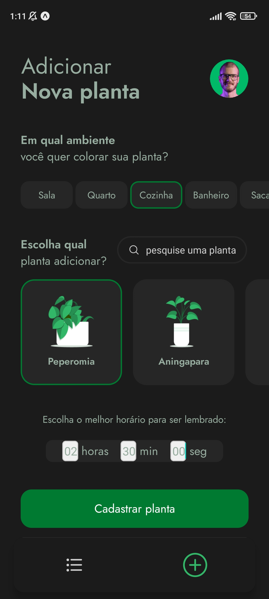

# :four_leaf_clover: PlantManager :four_leaf_clover:

App para ajudar a regar suas plantas no tempo certo.
<p align="center">
  <a href="#page_facing_up-projeto">Projeto</a> &nbsp;&nbsp;&nbsp;|&nbsp;&nbsp;&nbsp;
  <a href="#art-layout">Layout</a> &nbsp;&nbsp;&nbsp;|&nbsp;&nbsp;&nbsp;
  <a href="#hammer_and_wrench-tecnologias">Tecnologias</a> &nbsp;&nbsp;&nbsp;|&nbsp;&nbsp;&nbsp;
  <a href="#computer-como-executar">Como executar</a>
</p>

## :page_facing_up: Projeto
App para ajudar a regar suas plantas no tempo certo. Que foi utilizado React Native com TypeScript, Expo e React Navigation com a navegação bottom-tabs. Para armazenar as plantas criadas foi utilizado o MySQL com Node.js e Express.

## :art: Layout
<div align="center">
  
  &nbsp;&nbsp;&nbsp; &nbsp;&nbsp;&nbsp;
  
</div>

## :hammer_and_wrench: Tecnologias
Este projeto foi desenvolvido com as seguintes tecnologias

- [React Native](https://reactnative.dev)
- [React Navigation](https://reactnavigation.org)
- [TypeScript](https://www.typescriptlang.org)
- [Expo](https://expo.dev)
- [Node.js](https://nodejs.org/en/)
- [Express](https://expressjs.com)
- [MySQL](https://www.mysql.com)

## :computer: Como executar
Antes de começar, você vai precisar ter instalado em sua máquina as seguintes ferramentas:
[Git](https://git-scm.com), [Node.js](https://nodejs.org/en/), [Expo](https://expo.dev), [MySQL](https://www.mysql.com). Além disto é bom ter um editor para trabalhar com o código como [VSCode](https://code.visualstudio.com/)

```bash
# Clone este repositório.
$ git clone https://github.com/K3lvinBr/PlantManager.git

# Acesse a pasta do projeto no terminal/cmd
$ cd PlantManager

# Instale as dependências em cada pasta
cd plant_manager, cd services
$ npm install

# Execute a aplicação
cd plant_manager
$ expo start

cd services
$ node index.js

# Baixe o Expo Go no seu dispositivo para Android ou IOS
# O servidor iniciará na porta:3000 - acesse http://localhost:3000
```

---
Feito com ❤️ por Kelvin 👋 [Veja meu LinkedIn](https://www.linkedin.com/in/kelvin-sales-54306321a/)
